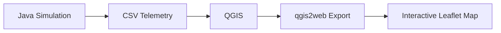
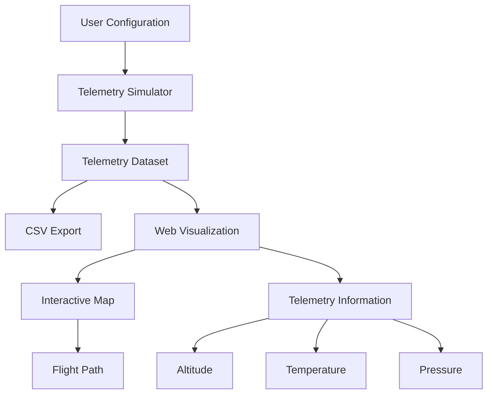

# Weather Balloon Telemetry

A weather balloon telemetry simulation and visualization project exploring how flight data can be generated, stored, and displayed geographically.

This repository contains the original exploratory prototype of the project as well as the foundation for a future redesign that I plan to implement with a better understanding of the simulation, software structure, and visualization process.

## Project Status

**Current status: Redesign planned**

The original prototype has been preserved under:

```text
legacy/exploratory-prototype/
```

Rather than continuing to build directly on the generated QGIS workflow, I plan to redesign the project so that the simulation and visualization are easier to understand, modify, and use.

The long-term goal is to create a web-based application where a user can configure a simulated weather balloon flight, generate telemetry, and visualize the resulting flight path directly on an interactive map.

## Original Prototype

The original project was created as an exploration of weather balloon telemetry and geographic visualization.

The prototype consists of two main parts:

1. A Java program that generates simulated weather balloon telemetry.
2. A QGIS/qgis2web workflow that converts the generated telemetry into an interactive Leaflet-based web map.

The simulation generates data including:

- Timestamp
- Latitude
- Longitude
- Altitude
- Temperature
- Atmospheric pressure

The generated data is stored in CSV files and then imported into QGIS for geographic visualization.

The resulting map was exported using qgis2web and Leaflet.

### Prototype Workflow



The original implementation is preserved in:

```text
legacy/
└── exploratory-prototype/
```

This includes the Java simulation, generated telemetry files, QGIS-generated website, screenshots, and the original README.

## Why I Am Revisiting the Project

The prototype helped introduce me to simulation, telemetry data, CSV-based data exchange, geographic visualization, and web mapping.

However, after working with the project, I identified several areas that I would like to improve.

### Simulation

The original simulation contains several assumptions and hard-coded values that I want to better understand and redesign.

Rather than increasing the complexity of the simulation immediately, I want the new version to begin with a simpler model that I can fully explain, test, and modify.

Future versions can gradually introduce more realistic behavior such as:

- changing wind
- altitude-dependent conditions
- configurable ascent and descent rates
- configurable burst altitude
- different launch environments
- more realistic atmospheric models

### Visualization

The original visualization relies heavily on QGIS and qgis2web-generated files.

While this produced a working interactive map, updating the visualization requires a relatively manual workflow:

```text
Generate CSV
    ↓
Import into QGIS
    ↓
Configure visualization
    ↓
Export with qgis2web
    ↓
Publish generated website
```

I would like the redesigned project to remove most of this manual process, and covert to a highly user friendly workflow:

```text
Configure Simulation
    ↓
Run Simulation
    ↓
Generate Telemetry
    ↓
Display Flight Directly on Web Map
```

This would make the project easier to use and would give me more direct experience developing the visualization myself.

## Planned Redesign

The redesigned project will be separated into clearer components.

```text
weather-balloon-telemetry/
│
├── legacy/
│   └── exploratory-prototype/
│
├── simulator/
│   └── redesigned simulation
│
├── web/
│   └── interactive telemetry visualization
│
├── sample-data/
│   └── example telemetry datasets
│
├── docs/
│   └── project documentation
│
└── README.md
```

### Planned Architecture



** The exact architecture may change as I learn more and begin implementing the redesign.

## Redesign Goals

The main goals for the next version are:

- Rebuild the simulator with simplier to undestand code.
- Separate simulation logic from data output for easier debugging and implementation.
- Make simulation parameters configurable instead of heavily hard-coded.
- Create a cleaner telemetry data model.
- Generate telemetry that can be reused by different visualization tools.
- Build a web-based interactive flight visualization.
- Reduce or remove the manual QGIS workflow.
- Improve project documentation and code organization.
- Use Git and GitHub throughout development to document the project's evolution.

## Roadmap

### Phase 1 — Preserve and Understand the Prototype

- [x] Preserve the original exploratory implementation.
- [x] Separate the prototype from future development.
- [ ] Review the original Java simulation line by line.
- [ ] Document what each part of the original model does.
- [ ] Identify which parts should be kept, changed, or removed.

### Phase 2 — Rebuild the Simulator

- [ ] Design a simple telemetry data model.
- [ ] Implement configurable launch parameters.
- [ ] Implement balloon ascent.
- [ ] Implement balloon burst and descent.
- [ ] Implement basic horizontal drift.
- [ ] Generate telemetry at consistent time intervals.
- [ ] Export simulation results to CSV.
- [ ] Add testing and input validation.

### Phase 3 — Build the Web Visualization

- [ ] Create an interactive map.
- [ ] Load generated telemetry.
- [ ] Display the simulated flight path.
- [ ] Display individual telemetry points.
- [ ] Display altitude, temperature, and pressure information.
- [ ] Allow a user to run or configure a simulation from the application.

### Phase 4 — Future Improvements

Possible future additions include:

- altitude-based wind layers
- real weather or atmospheric data
- telemetry graphs
- animation of the balloon flight
- live or recorded sensor telemetry
- integration with wireless telemetry projects
- comparison between simulated and real flight data

## What I Learned From the Prototype

The original project was my first experience working with several concepts including:

- software simulation
- telemetry data
- CSV data generation
- geographic coordinate data
- QGIS
- Leaflet-based web maps
- mapping and visualization workflows

The exploratory version was developed with substantial AI assistance. While I was able to use and understand portions of the resulting system, I did not independently design every part of the implementation.

That is one of the main reasons I am preserving the prototype and rebuilding the project.

The redesign is intended to help me develop a deeper understanding of the software by making the architectural and implementation decisions myself, while using documentation and other learning resources to understand the tools involved.

I also learned that additional complexity does not automatically make a simulation better. A simpler model that I can understand, test, and explain provides a stronger foundation for gradually adding more realistic behavior.

## Technologies

### Exploratory Prototype

- Java
- CSV
- QGIS
- qgis2web
- Leaflet
- HTML
- JavaScript
- CSS

### Redesign

The technology stack for the redesigned version has not been finalized yet.

I plan to choose technologies based on what the project requires and what will allow me to learn in-depth the skills required for projects of this magnitude. I hope to understand and implement each component effectively.